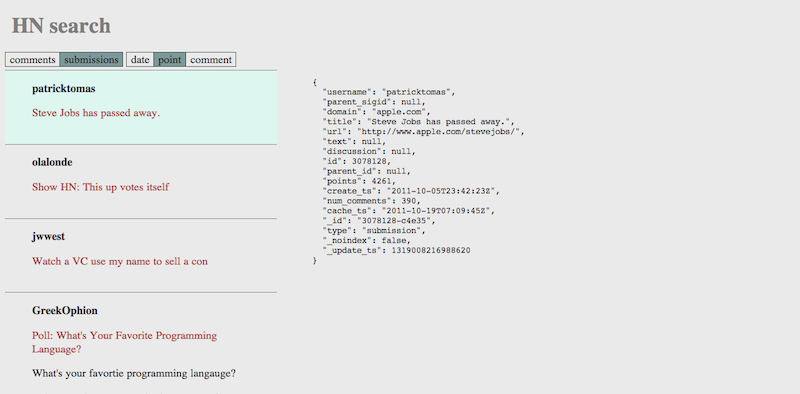

This blog post is the second part of my Backbone tutorial.
If you haven't read [the previous post], I'd recommend to read through the one at first.
I'm going to add a few feature to [the previous example].
There are two modules added.

* `FilterView` - filter ItemCollection search
* `AppRouter` - application's main router

The Example is [placed on Github].

<div class='img-container'>
  <a href='http://smagch.github.com/backbone-examples/filter/'>
    </img>
  </a>
</div>

## [Keep Collection and View minimal](#keep-collection-and-view-minimal)

I added a filter feature to `ItemCollection` adding query parameters: `type` and `sort`.

* "type" - "comment" and "submission".
* "sort" - "create_ts", "points" and "num_comments"

The Route spec is simply "#:type/:sort".
So when you go to [#submission/num_comments] route,
you'll see the most commented 20 submissions.

There are potentially 6 view states as filter parameter changes.

* "type" => "comment" & "sort" => "create_ts"
* "type" => "comment" & "sort" => "points"
* "type" => "comment" & "sort" => "num_comments"
* "type" => "submission" & "sort" => "create_ts"
* "type" => "submission" & "sort" => "points"
* "type" => "submission" & "sort" => "num_comments"

How to manage view states?
How many View/Collection do you instantiate?
There are potentially 3 options.

* 6 View & 6 Collection
* 6 View & 1 Collection
* 1 View & 1 Collection

Do you use jQuery plugin to switch views?
Even so, maintaining 6 views is certainly painful.
What if there are more filter parameters? You'll need to maintain more View/Collection.
Thus it's better to keep it simple: just one View and one Collection.

But there is a downside when we take the one Collection solution.
It performs new request every time when filter changes.
Now it's time to implement cache functionality overriding `.sync()` method.
There is a nice [post by LinkedIn] which uses LocalStorage.
In this example, I uses Isaac Schlueter's [lru-cache] for caching responses.
Now `ItemCollection` looks something like this.

```javascript

/**
 * Hacker News Item Collection
 *
 * parameters
 *   - type: "comment" or "submission"
 *   - sort: "create_ts" or "points" or "num_comments"
 *
 * Cache up to recently used 10 requests based of query parameter hash
 * You may want to use LocalStorage for caching
 * http://engineering.linkedin.com/mobile/linkedin-ipad-using-local-storage-snappy-mobile-apps
 *
 * In this case, it use Isaac Schlueter's lru-cache
 * https://github.com/isaacs/node-lru-cache
 *
 * For real HN app, you'll want to set `maxAge` option in LURCache
 * since HN Search API reject stale signedId
 *
 * Note: It won't work in old browsers since LRUCache uses `Object.defineProperty`
 */

var ItemCollection = Backbone.Collection.extend({
  model: ItemModel,
  initialize: function () {
    this._selected = null;
    this._params = {};
    this.cache = new LRUCache(10);
  },
  hasChange: function (params) {
    for (var key in params) {
      if (this._params[key] !== params[key]) {
        return true;
      }
    }
    return false;
  },
  filter: function (obj, options) {
    // balk if it obj has no changes
    if (!this.hasChange(obj)) return;
    // deselect if there is selection
    this.deselect();
    _.extend(this._params, obj);
    this.trigger('filter', _.clone(this._params), options);
    return this.fetch(options);
  },
  getFilterHash: function () {
    return $.param({
      'filter[fields][type]': this._params.type,
      limit: 20,
      sortby: this._params.sort + ' desc'
    });
  },
  url: function () {
    return 'http://api.thriftdb.com/api.hnsearch.com/items/_search?'
      + this.getFilterHash() + '&callback=?';
  },
  parse: function (res) {
    return res.results;
  },
  select: function (id, options) {
    var model = this.get(id);
    if (!model) throw new Error('invlid id : ' + id);
    // balk if when the modal is already selected
    if (this._selected === model) return;
    // selected model should be single
    if (this._selected) this.deselect();
    this._selected = model;
    this.trigger('select', model, options);
    return this;
  },
  deselect: function () {
    if (!this._selected) return;
    this.trigger('deselect', this._selected);
    this._selected = null;
    return this;
  },
  sync: function (method, model, options) {
    if (method !== 'read') {
      return Backbone.sync.call(this, method, model, options);
    }
    var self = this;
    var key = this.getFilterHash();
    var value = this.cache.get(key);
    var xhr;
    if (!value) {
      xhr = Backbone.sync.call(this, method, model, options);
      xhr.done(function (res, msg, xhr) {
        self.cache.set(key, res);
      });
      return xhr;
    }
    // perform psudo request
    xhr = $.Deferred();
    _.defer(function () {
      // this is always true if it's from `.fetch()` call
      if (options && typeof options.success === 'function') {
        options.success(value, 'success', xhr);
      }
      xhr.resolve(value, 'success', xhr);
    });
    return xhr.promise();
  }
});
```

It need to be the same manner that `Backbone.sync()` does since it overrides `.sync()` method.

* return [Promise] just as `$.ajax()`
* it calls `options`'s "success" or "error" function based on its response status

It caches a response through `.done()` callback.
The [Deferred Object] will be resolved quickly through `_.defer()` when it has a cached response.
It should be noted that the cached response doesn't emulate `$.ajax()` [Promise] completely.
You'll have a trouble if you expect properties such as `status` and `statusText`.

Before you start [Backbone.js] development, there is one thing that worth keep in mind.
Web application development is not just a web development.
jQuery plugins that is nice with web development isn't always nice with [Backbone.js] development.
In this case, jQuery tab plugin doesn't really fit in for switching views.
Because each view state is tightly bound to Collection/Model which update view state through events.

## [Treat Router as peer module to Views](#treat-router-as-peer-module-to-views)

When `ItemCollection` is filtered, `ItemView` and `FilterView` update their DOM element through events: `"reset"` event and `"filter"` event.

* `ItemView` - update with `"reset"` event.
* `FilterView` - update with a custom event: `"filter"`.

```javascript

var FilterView = Backbone.View.extend({
  initialize: function () {
    this.collection.on('filter', this.render, this);
  },
  events: {
    'click [data-type]': 'typeClicked',
    'click [data-sort]': 'sortClicked'
  },
  typeClicked: function (e) {
    e.stopPropagation();
    var $target = $(e.currentTarget);
    var type = $target.attr('data-type');
    this.collection.filter({ type: type });
  },
  sortClicked: function (e) {
    e.stopPropagation();
    var $target = $(e.currentTarget);
    var sort = $target.attr('data-sort');
    this.collection.filter({ sort: sort });
  },
  render: function (params, options) {
    this.$('[data-type=' + params.type + ']')
      .addClass('active')
      .siblings('.active').removeClass('active');
    this.$('[data-sort=' + params.sort + ']')
      .addClass('active')
      .siblings('.active').removeClass('active');
  }
});

```

In [the previous post], I mentioned that view update shouldn't be directly through DOM events.
Let's consider once again: why does `FilterView` update through `"filter"` event, not `"click"` DOM event?
Because there is another module which filter collection,
it should be done through a event from `ItemCollection` to keep event flow simple.
Which module call `.filter()` method in this app?
`AppRouter` filter the collection when the app starts!

```javascript
var AppRouter = Backbone.Router.extend({
  routes: {
    '': 'update',
    ':type': 'update',
    ':type/:sort': 'update'
  },
  initialize: function (options) {
    this.collection = options.collection
      .on('filter', this.hashChange, this);
    this.defaults = options.defaults;
  },
  hashChange: function (collection) {
    var params = collection.params();
    var hash = params.type + '/' + params.sort;
    this.navigate(hash);
  },
  update: function (type, sort) {
    var params = _.defaults({}, {
      type: type,
      sort: sort
    }, this.defaults);
    this.collection.params(params);
  }
});
```

`FilterView` and `AppRouter` does exactly same two things.

* update `ItemCollection` filter parameter through `.filter()` method
* render its DOM element when `ItemCollection`'s parameters change.

Just as View render its DOM element, Router render location hash in browser's url box.
Both `FilterView` and `AppRouter` show user a filter state.
And both of them can be used to update filter parameters.

## Don't `.fetch()` outside of module

As I [mentioned in the previous post], `.trigger()` is worth prohibited.
`.fetch()` is worth it as well in this case because all server requesting is done through `.filter()` method.

## [Summary](#Summary)

I've come up with `"filter"` event and assembled modules through custom events.
The application has just one Collection: `ItemCollection` which trigger three types of custom events: `"select"`, `"deselect"`, `"filter"`.
Each of View/Router listens on the events. And also View/Router call the methods `.select()`, `.deselect()`, `.filter()` that will trigger the custom events.

### ItemView

* listen on `"reset"`, `"filter"`, `"select"`, `"deselect"`.
* call `.select()` through `"click"` DOM event

### FilterView

* listen on `"filter"`.
* call `.filter()` through `"click"` DOM event

### JsonView

* listen on `"select"`, `"deselect"`

### AppRouter

* listen on `"filter"`
* call `.filter()` through `"route"` event

### body

* call `.deselect()` through `"click"` DOM event

Can you see how event flow works?
In the next post, I'll replace `JsonView` to a something more interesting thing.

[placed on Github]: https://github.com/smagch/backbone-examples/tree/gh-pages/filter
[Backbone.js]: http://backbonejs.org/
[post by LinkedIn]: http://engineering.linkedin.com/mobile/linkedin-ipad-using-local-storage-snappy-mobile-apps
[lru-cache]: https://github.com/isaacs/node-lru-cache
[Deferred Object]: http://api.jquery.com/category/deferred-object/
[Promise]: http://api.jquery.com/promise/
[HN Search API]: http://www.hnsearch.com/api
[#submission/num_comments]: http://smagch.github.com/backbone-examples/filter/#submission/num_comments
[the previous post]: http://smagch.github.com/posts/2012-11-20-model-is-stateful.html
[the previous example]: http://smagch.github.com/backbone-examples/select2/
[mentioned in the previous post]: http://smagch.github.com/posts/2012-11-20-model-is-stateful.html#dont-trigger-outside-of-module